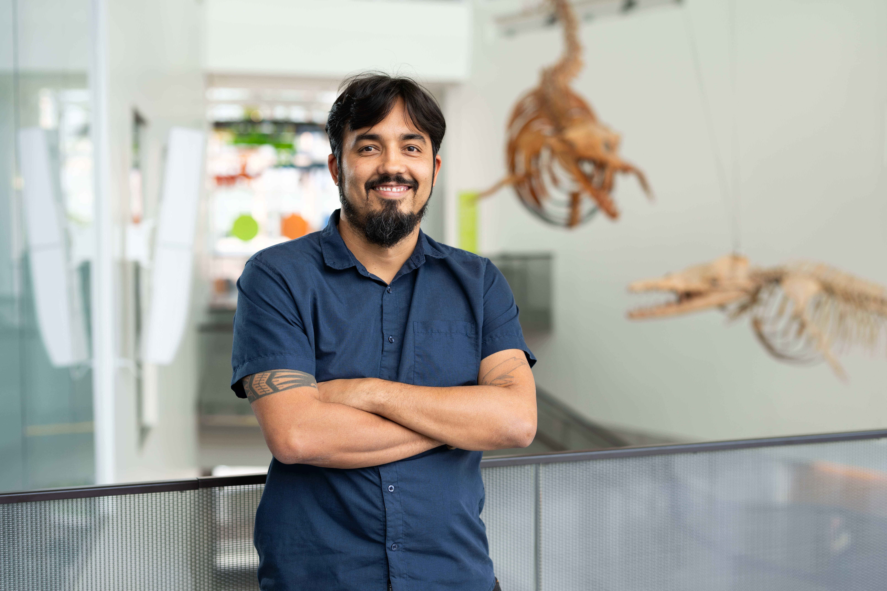

{.inset-right .oval}

# Thiago Gonçalves-Souza
**Assistant Research Scientist**, Institute for Global Change Biology (School of Environment and Sustainability & Department of Ecology and Evolutionary Biology), University of Michigan.

I am a quantitative community ecologist dedicated to exploring the influence of anthropogenic, ecological, and evolutionary processes on biodiversity patterns and the subsequent impacts on ecosystem functioning. My current research centers around synthesizing the effects of human-mediated habitat loss and climate change on animals and plants. With a broad taxonomic scope ranging from arthropods to mammals, I use quantitative tools to unravel the intricate dynamics of biodiversity change. I also investigates the utility of traits in predicting species redistributions across local and global scales.

[CV](files/cv.pdf) · [ORCID](https://orcid.org/0000-0001-8471-7479) · [Google Scholar](https://scholar.google.com.br/citations?hl=en&user=TjaP2l8AAAAJ&view_op=list_works&sortby=pubdate)

## News
- [March 2025] New paper published in Nature: *Increasing species turnover does not alleviate biodiversity loss in fragmented landscapes*. <https://doi.org/10.1038/s41586-025-08688-7>

## Highlights
- **Exchange students** — Gabriel Boldorini will visit [IGCB](https://seas.umich.edu/globalchangebiology) in October 2025.
- **Exchange students** — Luh Seixas will visit [EEB](https://lsa.umich.edu/eeb) in October 2025.
